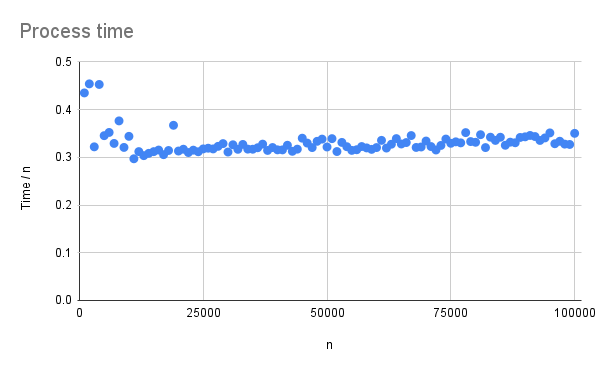
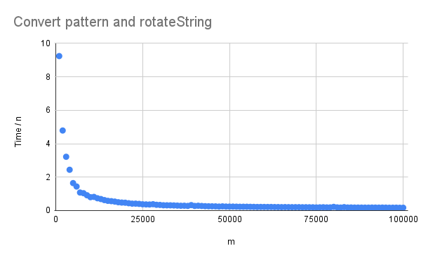

# Project 4: BWT-based matching (FM-index)

Now that you have a functioning suffix array, you should implement the BWT-based search, also known as FM-index. This algorithm improves the search in the suffix array from O(m log n + z) to O(m + z) after O(n) preprocessing (plus whatever time it takes you to build your suffix array).

You should implement a suffix array construction algorithm. You can choose to implement the naive algorithm where you explicitly sort strings, or the O(n) skew or SAIS algorithms, or any other algorithm. After constructing the suffix array, you should implement the binary search based and the Burrows-Wheeler based search algorithm.

The algorithms should be implemented in a program named `fm`. Since we are building data structures in a preprocessing step, and since a common usage of read mappers is to map multiple files of reads against the same genome, we should build the tool such that we can preprocess a genome once, and then reuse the preprocessed data on subsequent searches.

Therefore, your tool should have options for either preprocessing or read-mapping. If you run it as `fm -p genome.fa` it should preprocess the sequences in `genome.fa`, and if you run the tool as  `fm genome.fa reads.fq` it should search the genome and produce output in the same format as the previous projects.

When you preprocess `genome.fa` you should write the result to file. You are free to choose what you write to file, how many files you use, or how you represent the output. Use the input file name, here `genome.fa` but it can be any file name, to select the file names for your preprocessed data. That way, when you run a search with `fm genome.fa reads.fq`, your tool can determine which preprocessed files to read from the second first argument.

## Evaluation

Once you have implemented the `fm` program (and tested it to the best of your abilities) fill out the report below, and notify me that your pull request is ready for review.

# Report

## Preprocessing

*What preprocessing data do you store in files, and how?*

We store the preprocessed data in a .txt file with \n between each data point. For multiple sequnences in the same fasta file, one is stored after the other. We store the following:
* The sequence header. This is needed for the output.
* n, the length of the sequence. Can be deduced from the other data, but make sense to save, since we can then malloc with it. 
* σ, alphabetsize. 
* bwt of the converted sequence (where the chars are ints 0...σ-1). With commas between each char. We could same O and C, but they would take more space. 
* SA. Comma seperated
* The alphabet. No seperation chars, since each symbol is a unique char. 

## Insights you may have had while implementing the algorithm
It takes 90% of the time to do the last 10% of the code, testing and writting the report. 

Between this and the last handin, it has become part of the coding process to do most of the coding on one (Windows) machine, push the code and finish it on another (Linux). The code will be running fine on the first machine, but will be buggy on the other, which we will then fix. It is unclear which types of bugs is ignored, but it seems like the first machine is more forgiving with memory. 

There are many ways to run the code. We mainly use the 'run' and 'debug' buttons in the editor (CLion) or run the code from the terminal. We have learned that the code will sometimes fail in one, but not the others. This is expecially weird when there is an error when running the code in the editor, but not when debugging. These erros seem to be the same we find by switching machines. 

We (finally) took the time learn how to make dynamic sized arrays with realloc. 

## Problems encountered if any

The problems where mostly with memory. We had a problem, where we got a sigtrap error at a seemily random malloc (The same problem mentioned in class). 
We solved this problem moving a malloc around in the code, to find the cause. It turned out to be because of the wrong type in sizeof in a realloc. 

To be able to time part of our code independtly in reasonable time, we need a way to make the bwt for testing faster than with our main functions. 
Since we knew how we generated sequences, we knew what the bwt would contain. It took longer than it should to find the right defintion for the implementation.

## Validation

*How did you validate that the preprocessing and the search algorithm works?*

For the preprossesing we mostly ran examples and manually checked whether the document was as expected. 

We tested the main functions for search in testRotaion.c with some sequences for which we knew the result. 

Lastly we compared the results of search with the results from previous handins. 
As input, we used the random sequences in long.fa and long.fastq. 

## Running time

*List experiments and results that show that both the preprocessing algorithm and the search algorithm works in the expected running time. Add figures by embedding them here, as you learned how to do in project 1.*

Since we use the radix sort based SA algorithm, preprocessing is dominated by it and runs in O(n²), which we have shown previously.
Preprocessing can be done in O(n) by using faster SA algorithms.  
Below, we look at the processing time, which we here define as the time for converting SA to bwt and writing the preprocessing to file. It follows O(n). 
Since parsing, as shown in earliere handins, runs in O(n) and SA can run in O(n), this is the expected. 

Reading from the preprocessed file takes O(n). Making the O table takes O(σn).
Ignoring this, search takes O(m). When we parse the fasta, we convert the alphabet of the sequence, such that each char can be used as an index. 
For us to be able to search for the pattern we need to convert it too, which is done in O(m) time. Then we search in O(m) time. We have plottet the time for convertion and searching below. 

